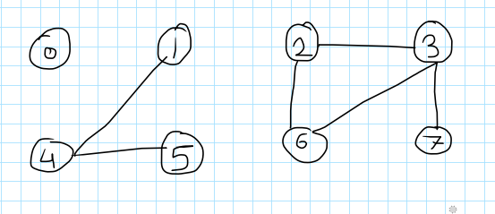

## Dynamic Connectivity Problem - https://en.wikipedia.org/wiki/Dynamic_connectivity

### Modelling the connections, we assume some properties:
1. Reflexive: p is connected to p.
2. Symmetric: p is connected to q and q is connected to p.
3. Transitive: p is connected to q and q is connected to r, then p is connected to r.

### Connected Components
Maximal <r>set</r> of objects that are mutually connected.

{0}, {1, 4, 5}, {2, 3, 6, 7} - 3 connected components

### Union-Find Data Type (API)
So, the API for the dynamic connectivity should be able to perform following operations-
1. Union - add connection between p and q
2. connected - query to check if p and q are connected
3. It can have other operations like find(p) - p is in which connected component, count - number of connected components

### Dynamic connectivity algorithms
#### Quick Find
Eager algorithm to solve the DCP is using. Two objects p and q are connected if they have same id.

#### Lazy Quick Union
Using trees in the forest to represent the connected nodes.
So, id of each object corresponds to its parent in the forest. For eg- 

#### Weighted Quick Union 
We can improve the Lazy Quick Union by using weighting (1st improvement) where the forest with the lowest size is connected to the forest with bigger size during the union operation.

#### Path Compression Weighted Quick Union
This is the 2nd improvement of the Lazy Quick Union algorithm by setting the root of each node to its grandparent during the root operation to reduce the root search and flattening the tree.

### Performance of different Union Find Data Types

| Algorithm                             | initialize | union | connected | worst case time |
|:--------------------------------------|:----------:|:-----:|:---------:|:---------------:|
| Quick Find                            |     N      |   N   |     1     |       MN        |
| Lazy Quick Union                      |     N      |   N   |     N     |       MN        |
| Weighted Quick Union                  |     N      | logN  |   logN    |   N + M logN    |
| Path Compression Weighted Quick Union |     N      | logN  |   logN    |   N + M log*N   |

